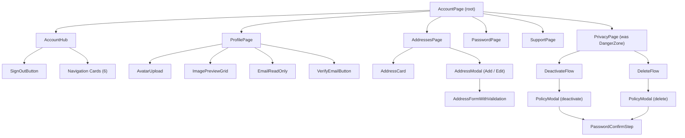
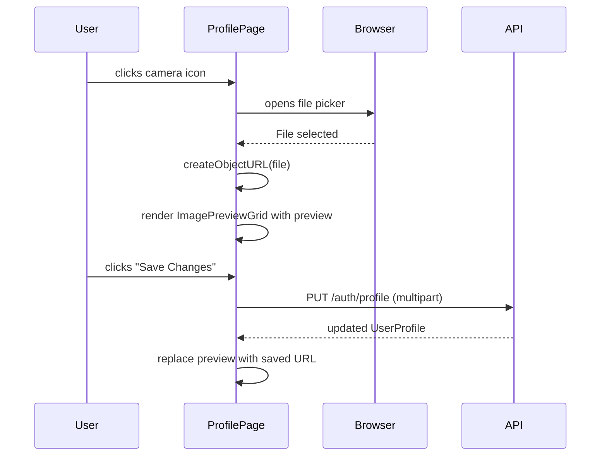
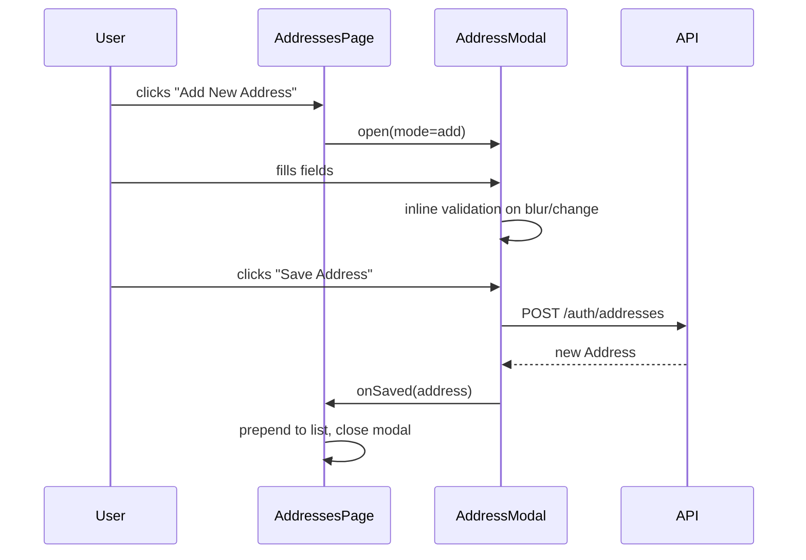
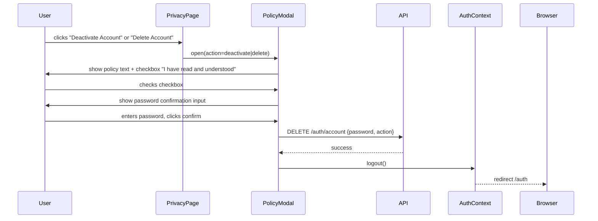

# Design Document: Account Page Redesign

## Overview

This document describes the redesign of `client/src/pages/User/Account.tsx` — the customer-facing account management page. The changes span six areas: the Account Hub (banner/hero), Account Info (profile), Addresses, Password, Help & Support, and the renamed "Privacy & Account Control" sub-page (formerly "Danger Zone"). The goals are improved visual consistency, better UX patterns (modals instead of inline forms, clearer destructive-action flows), and a safer, more informative account-deletion/deactivation experience.

The existing routing structure (`/account`, `/account/profile`, `/account/addresses`, `/account/password`, `/account/support`, `/account/danger`) is preserved, with the danger route kept as-is for backward compatibility while the displayed label changes.

---

## Architecture



---

## Sequence Diagrams

### Avatar Upload & Preview



### Add / Edit Address (Modal Flow)



### Account Deactivation / Deletion Flow



---

## Components and Interfaces

### AccountHub

**Purpose**: Landing screen showing user identity, navigation cards, and sign-out.

**Changes from current**:
- Remove phone, gender, DOB pills from the hero banner
- Remove "Edit Profile" button from the hero
- Add a "Sign Out" button (bottom of hub or inside hero area)

**Interface**:
```typescript
// No new props — reads from useAuth() and useProfile()
interface AccountHubProps {} // internal component, no external props
```

**Responsibilities**:
- Display avatar, name, email in hero
- Render 6 navigation cards
- Provide Sign Out action via `useAuth().logout()`

---

### ProfilePage

**Purpose**: Edit personal details, upload avatar, view read-only email with verify option.

**Changes from current**:
- Center the card (`mx-auto`)
- After file selection, show `ImagePreviewGrid` below the avatar circle
- Add read-only email field
- Add "Verify" button next to email (triggers email verification flow)

**Interface**:
```typescript
interface ImagePreviewGridProps {
  file: File;
  previewUrl: string;
  onRemove: () => void;
}
```

**Responsibilities**:
- Load and display current profile via `getProfile()`
- Handle avatar file selection → preview → upload on save
- Show email as read-only input with a "Verify" badge/button
- Submit form via `updateProfile(FormData)`

---

### AddressModal

**Purpose**: Reusable modal for both adding and editing an address, replacing the current inline `AddressForm`.

**Interface**:
```typescript
interface AddressModalProps {
  mode: "add" | "edit";
  initial?: Partial<AddressFormData>;
  onSave: (data: AddressFormData) => Promise<void>;
  onClose: () => void;
}

interface AddressFormData {
  line1: string;
  line2: string;
  city: string;
  state: string;
  zip: string;
  country: string;
}

interface AddressFieldError {
  line1?: string;
  city?: string;
  state?: string;
  zip?: string;
}
```

**Responsibilities**:
- Render inside a Bootstrap modal overlay
- Validate fields inline (on blur and on submit attempt)
- Show per-field error messages below each input
- Call `onSave` and close on success; surface API errors inline

---

### PrivacyPage (formerly DangerZonePage)

**Purpose**: Provide safe, policy-informed flows for account deactivation and permanent deletion.

**Changes from current**:
- Rename title to "Privacy & Account Control"
- Two distinct action cards: Deactivate and Delete
- Each opens a multi-step `PolicyModal`

**Interface**:
```typescript
type AccountAction = "deactivate" | "delete";

interface PolicyModalProps {
  action: AccountAction;
  onClose: () => void;
  onConfirmed: () => void; // called after successful API call
}

interface PolicyModalState {
  step: "policy" | "confirm";
  policyAccepted: boolean;
  password: string;
  loading: boolean;
  error: string;
}
```

**Responsibilities**:
- Step 1 (policy): Display action-specific policy text; require checkbox acceptance before proceeding
- Step 2 (confirm): Password input + final confirm button
- On success: call `logout()` and redirect to `/auth`

---

## Data Models

### AddressFormData (validation rules)

```typescript
interface AddressFormData {
  line1: string;   // required, min 5 chars
  line2: string;   // optional
  city: string;    // required, letters/spaces only
  state: string;   // required, letters/spaces only
  zip: string;     // required, 6-digit numeric (India PIN)
  country: string; // required, default "India"
}
```

**Validation Rules**:
- `line1`: non-empty, minimum 5 characters
- `city`: non-empty, no digits or special characters
- `state`: non-empty, no digits or special characters
- `zip`: exactly 6 digits (`/^\d{6}$/`)
- `country`: non-empty

### PolicyModal content per action

| Action | Title | Policy Summary | Grace Period | Confirm Button Label |
|---|---|---|---|---|
| `deactivate` | Deactivate Account | Account goes dormant; log in within 30 days to reactivate; after 30 days account and all data are permanently deleted | 30 days — log in to cancel | "Deactivate My Account" |
| `delete` | Delete Account | Initiates permanent deletion; log in within 30 days to cancel; after 30 days all account data is permanently and irrecoverably wiped | 30 days — log in to cancel | "Permanently Delete Account" |

---

## Error Handling

### Address Modal Validation Errors

**Condition**: User submits form with missing/invalid fields  
**Response**: Per-field inline error messages appear below each input; form does not submit  
**Recovery**: User corrects fields; errors clear on valid input

### Email Verification

**Condition**: User clicks "Verify" next to email  
**Response**: Show a toast/inline message "Verification email sent" (or error if API fails)  
**Recovery**: User can retry; button disabled while request in flight

### Policy Modal — Wrong Password

**Condition**: API returns 401/403 on deactivate/delete  
**Response**: Inline error below password field: "Incorrect password. Please try again."  
**Recovery**: User re-enters password; loading state resets

### Policy Modal — Network Error

**Condition**: API call fails with network error  
**Response**: Inline error message; confirm button re-enabled  
**Recovery**: User can retry

---

## Testing Strategy

### Unit Testing Approach

- `AddressModal`: test validation logic for each field (empty, too short, invalid zip format)
- `PolicyModal`: test step transitions (policy → confirm), checkbox gate, password submission
- `ImagePreviewGrid`: test render with a mock File/URL, test `onRemove` callback

### Property-Based Testing Approach

**Property Test Library**: fast-check

- Address zip validation: for any string that is not exactly 6 digits, `validateZip(s)` returns an error
- Address city/state validation: for any string containing a digit or special char, validation returns an error
- PolicyModal step machine: from `step=policy`, `policyAccepted=false`, clicking confirm never advances to `step=confirm`

### Integration Testing Approach

- Full add-address flow: open modal → fill valid data → submit → address appears in list → modal closed
- Deactivation flow: click deactivate → policy modal opens → accept policy → enter password → API called with correct payload → logout triggered

---

## Performance Considerations

- Avatar preview uses `URL.createObjectURL` (revoked on component unmount to avoid memory leaks)
- Address modal is conditionally rendered (not mounted until opened) to avoid unnecessary DOM nodes
- Policy modal content is static strings — no async loading needed

---

## Security Considerations

- Email field is strictly read-only in the UI; the backend must also reject email changes via the profile update endpoint
- Password confirmation before deactivation/deletion prevents CSRF-style accidental triggers
- The "Delete Account" API call should be a separate endpoint from "Deactivate" to prevent accidental permanent deletion (currently both use `DELETE /auth/account` — a `action` discriminator field or separate endpoint should be added)
- Avatar uploads are restricted to `image/*` MIME types client-side; server must also validate

---

## Dependencies

- `framer-motion` — existing, used for page transitions and modal entrance animations
- `lucide-react` — existing icon library; add `ShieldAlert`, `LogOut` icons as needed
- Bootstrap modal classes — existing CSS framework used throughout the page
- `accountService.ts` — needs a new `deleteAccount(password)` export distinct from `deactivateAccount`
- `authService.ts` — `sendVerificationEmail` endpoint (new, if email verification is in scope)
