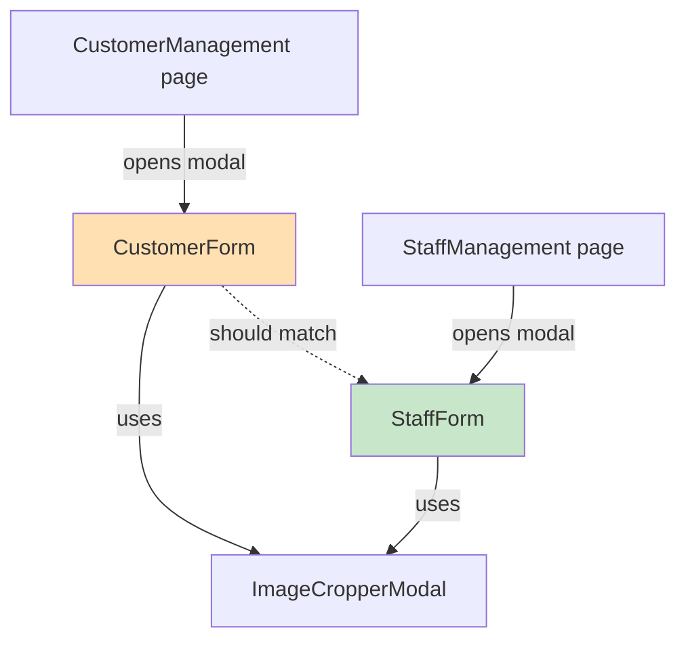
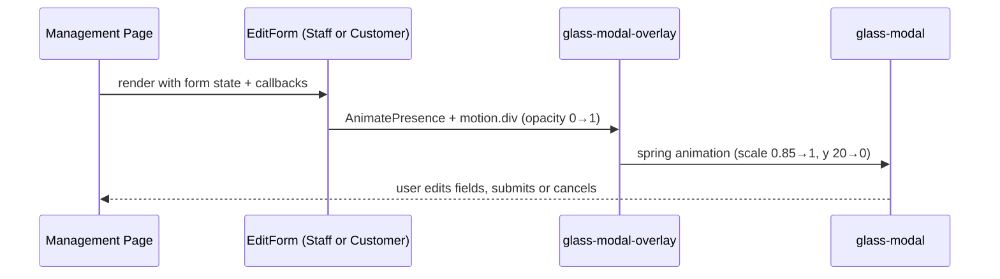
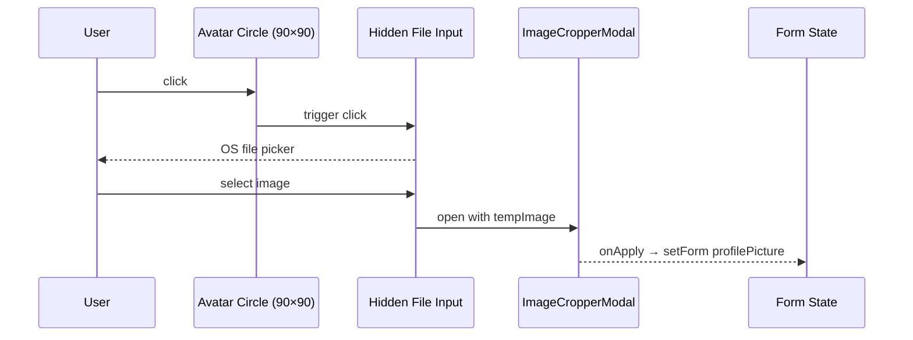

# Design Document: Customer Edit Modal Redesign

## Overview

The customer edit modal (`CustomerForm.tsx`) needs to be brought into full visual and structural parity with the staff edit/add modal (`StaffForm.tsx`). Both modals already share the same modal shell, input styles, and footer — but there are subtle differences in avatar uploader behavior, the change-password section layout, and the submit button icon logic that need to be aligned.

The goal is a single consistent "admin edit modal" pattern across the panel so that any admin user experiences the same look, feel, and interaction model regardless of whether they are editing a staff member or a customer.

## Architecture



## Sequence Diagrams

### Modal Open Flow



### Avatar Upload Flow



## Components and Interfaces

### CustomerForm

**Purpose**: Edit-only modal for customer records. Always in "edit" mode (no create flow for customers from admin).

**Interface**:
```typescript
interface CustomerFormProps {
  form: any;
  setForm: React.Dispatch<React.SetStateAction<any>>;
  isSaving: boolean;
  onSubmit: (e: React.FormEvent) => void;
  onBack: () => void;
}
```

**Responsibilities**:
- Render modal overlay + animated modal card
- Display avatar uploader (always shown, since always edit mode)
- Render form fields: name, email, phone, date of birth, gender
- Render change-password toggle section
- Validate on blur and on submit
- Delegate image cropping to `ImageCropperModal`

### StaffForm (reference)

**Purpose**: Add and edit modal for staff records. Supports both create and edit modes via `isEdit` prop.

**Interface**:
```typescript
interface StaffFormProps {
  form: any;
  setForm: React.Dispatch<React.SetStateAction<any>>;
  isSaving: boolean;
  isEdit?: boolean;
  onSubmit: (e: React.FormEvent) => void;
  onBack: () => void;
}
```

**Responsibilities**:
- Same as CustomerForm, plus:
- Conditionally show permissions panel (superadmin only)
- Conditionally show password field (create mode) vs change-password toggle (edit mode)
- Dynamic submit button icon (save vs create)

## Data Models

### Shared Form Shape (Customer)

```typescript
interface CustomerFormState {
  name: string;
  email: string;
  phone: string;                  // stored as "+91XXXXXXXXXX"
  dateOfBirth?: string;           // ISO date string
  gender?: string;
  profilePicture?: File;          // new upload (File object)
  existingProfilePicture?: string; // current URL from server
  newPassword?: string;           // only when changePassword is true
}
```

### Shared Style Tokens

```typescript
const inputStyle: React.CSSProperties = {
  width: '100%', padding: '14px 16px', borderRadius: '14px',
  border: '1.5px solid #f0f0f2', background: '#fafafa',
  fontSize: '0.92rem', fontWeight: 600, color: '#1a1a1a',
  outline: 'none', transition: 'border-color 0.2s, box-shadow 0.2s',
};

const labelStyle: React.CSSProperties = {
  display: 'block', fontSize: '0.72rem', fontWeight: 800, color: '#aaa',
  textTransform: 'uppercase', letterSpacing: '0.8px', marginBottom: '8px',
};

const errorStyle: React.CSSProperties = {
  color: '#e74c3c', fontSize: '0.75rem', fontWeight: 600,
  marginTop: '4px', display: 'block',
};
```

## Diff Analysis: CustomerForm vs StaffForm

After reading both files, the modals are already structurally identical in:
- Modal shell: `glass-modal-overlay` + `glass-modal`, `maxWidth: 680px`, `borderRadius: 24px`
- Header: padding `24px 28px 20px`, title size `1.5rem / 900`, close button
- Scrollable body: `overflowY: auto`, `padding: 24px 28px`, `gap: 20px`
- Footer: `padding: 16px 28px 24px`, Cancel + Save buttons, `borderRadius: 14px`
- Input/label/error styles: identical tokens
- Avatar uploader: identical 90×90 circle with dashed border, hover overlay

The remaining differences to resolve:

| Area | CustomerForm (current) | StaffForm (reference) | Action |
|---|---|---|---|
| Avatar uploader | Always shown (correct for edit-only) | Shown only when `isEdit` | No change needed |
| Change-password section | `borderTop` + `paddingTop: 16px` | `borderTop` + `paddingTop: 20px` | Align padding to `20px` |
| Password rules error position | Error shown above rules grid | Error shown below rules grid | Move error span below rules grid |
| Submit button icon | Always shows save icon | Shows save icon (edit) or add-person icon (create) | No change needed (customer is always edit) |
| `marginBottom` on avatar wrapper | `4px` | `8px` | Align to `8px` |

## Key Functions with Formal Specifications

### validate()

**Preconditions:**
- `form` object is defined with at least `name`, `email`, `phone` fields
- `changePassword` boolean reflects current toggle state

**Postconditions:**
- Returns `true` if and only if all required fields pass their rules
- `errors` state is updated to reflect all current validation failures
- If `changePassword` is `false`, `newPassword` is not validated

**Loop Invariants:** N/A (sequential field checks)

### handleBlur(field)

**Preconditions:**
- `field` is a known form field key
- Event target has a `.value` string

**Postconditions:**
- Focus style is reset on the input
- `validateField` is called with current value
- `errors` state is updated for that field only

## Algorithmic Pseudocode

### Form Submission Flow

```pascal
PROCEDURE handleFormSubmit(event)
  INPUT: event (React.FormEvent)
  
  SEQUENCE
    event.preventDefault()
    isValid ← validate()
    
    IF isValid THEN
      onSubmit(event)
    END IF
  END SEQUENCE
END PROCEDURE
```

### Change Password Toggle

```pascal
PROCEDURE toggleChangePassword()
  SEQUENCE
    setChangePassword(NOT changePassword)
    setForm(prev → { ...prev, newPassword: '' })
    
    IF NOT changePassword THEN
      // clearing errors for newPassword when toggling off
      setErrors(prev → remove 'newPassword' from prev)
    END IF
  END SEQUENCE
END PROCEDURE
```

## Example Usage

```typescript
// In CustomerManagement page
<CustomerForm
  form={editForm}
  setForm={setEditForm}
  isSaving={isSaving}
  onSubmit={handleSaveCustomer}
  onBack={() => setShowEditModal(false)}
/>
```

## Correctness Properties

- The modal must render with `maxWidth: 680px` and `borderRadius: 24px` — identical to StaffForm
- The avatar uploader circle must be `90×90px` with `border: 2px dashed #ccc` and orange hover
- The change-password section padding-top must be `20px` (matching StaffForm)
- The avatar wrapper `marginBottom` must be `8px` (matching StaffForm)
- Password rule indicators must appear before the error span (matching StaffForm order)
- All input focus states must use `var(--prime-orange)` border and `rgba(255,140,66,0.1)` shadow
- The footer Cancel button must use `border: 1.5px solid #e8e8e8` and the Save button `background: var(--prime-orange)`

## Error Handling

### Validation Errors
**Condition**: User submits with invalid fields  
**Response**: `errors` state populated, form not submitted, error messages shown inline below each field  
**Recovery**: User corrects field; error clears on next blur or change event

### Image Upload Errors
**Condition**: User selects non-image file or oversized file  
**Response**: `ImageCropperModal` handles internally; `tempImage` remains null if cancelled  
**Recovery**: User re-selects a valid file

## Testing Strategy

### Unit Testing Approach
- Test `validate()` with missing name, invalid email, short phone, future DOB
- Test `validateField()` for each field in isolation
- Test change-password toggle clears `newPassword` and its error

### Property-Based Testing Approach
**Property Test Library**: fast-check

- For any `name` with fewer than 3 chars or non-alpha chars → `validate()` returns false
- For any valid 10-digit phone → phone validation passes
- For any `newPassword` failing any pwdRule → password validation fails when `changePassword` is true

### Integration Testing Approach
- Render `CustomerForm` with mock props, verify modal appears with correct dimensions
- Verify avatar click triggers file input
- Verify submit calls `onSubmit` only when all fields are valid

## Security Considerations

- Password is never stored in plain text; `newPassword` is only sent when `changePassword` is true
- Profile picture upload goes through `ImageCropperModal` which enforces `accept="image/*"`
- Phone number is sanitized to digits only before storing (`replace(/\D/g, '')`)

## Dependencies

- `framer-motion` — modal animations (`AnimatePresence`, `motion.div`)
- `ImageCropperModal` — shared image crop/upload component
- `var(--prime-orange)` — CSS custom property defined in `index.css`
- `glass-modal-overlay` / `glass-modal` — CSS classes for modal backdrop and card
