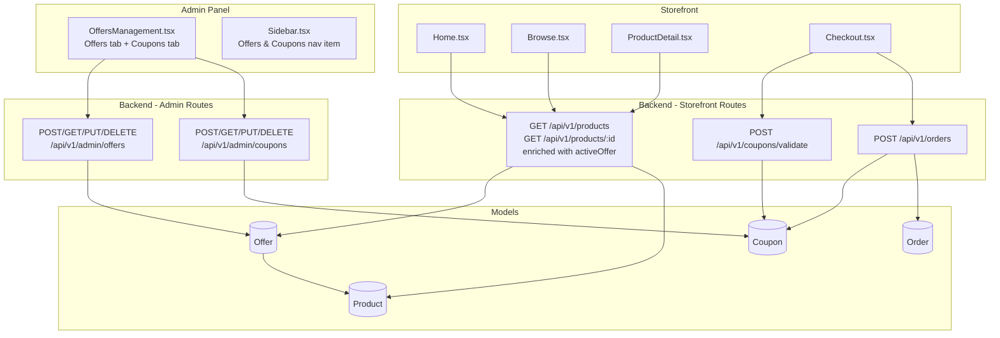

# Design Document: Offers & Promotions

## Overview

The Offers & Promotions feature adds two complementary discount mechanisms to PrimeHive:

1. **Product-level offers** — a superadmin creates an offer (label + discount) and links it to one or more products. When active, the storefront enriches every affected product response with offer metadata and a pre-computed discounted price, which the UI renders as a badge and a struck-through original price.

2. **Order-level coupons** — a superadmin creates coupon codes with configurable rules (discount type/value, minimum order, usage cap, expiry). At checkout, an authenticated customer enters a code; the backend validates it and returns the discount amount; the frontend shows the breakdown and sends the coupon data with the order.

Both mechanisms are managed through a single "Offers & Coupons" admin page, protected by the existing `superAdminOnly` middleware.

---

## Architecture



**Key design decisions:**

- Offers are stored as a separate `Offer` collection referencing `productIds`. The storefront product endpoints perform a lookup at query time — no denormalization on the Product document. This keeps the Product model clean and avoids stale data.
- The "one active offer per product" constraint is enforced at the controller level (not via a DB unique index) because it only applies to *active* offers, which is a runtime condition.
- Coupon validation is a separate endpoint (`POST /api/v1/coupons/validate`) that does not mutate state. Usage tracking happens only when an order is successfully placed.
- The `usedBy` array on Coupon stores user ObjectIds for per-customer deduplication. Guest checkout is not eligible for coupon use (the validate endpoint requires `verifyToken`).

---

## Components and Interfaces

### Backend

#### Admin Routes

| Method | Path | Middleware | Handler |
|--------|------|-----------|---------|
| POST | `/api/v1/admin/offers` | `verifyToken`, `superAdminOnly` | `createOffer` |
| GET | `/api/v1/admin/offers` | `verifyToken`, `superAdminOnly` | `getOffers` |
| GET | `/api/v1/admin/offers/:id` | `verifyToken`, `superAdminOnly` | `getOfferById` |
| PUT | `/api/v1/admin/offers/:id` | `verifyToken`, `superAdminOnly` | `updateOffer` |
| DELETE | `/api/v1/admin/offers/:id` | `verifyToken`, `superAdminOnly` | `deleteOffer` |
| POST | `/api/v1/admin/coupons` | `verifyToken`, `superAdminOnly` | `createCoupon` |
| GET | `/api/v1/admin/coupons` | `verifyToken`, `superAdminOnly` | `getCoupons` |
| PUT | `/api/v1/admin/coupons/:id` | `verifyToken`, `superAdminOnly` | `updateCoupon` |
| DELETE | `/api/v1/admin/coupons/:id` | `verifyToken`, `superAdminOnly` | `deleteCoupon` |

#### Storefront Routes

| Method | Path | Middleware | Handler |
|--------|------|-----------|---------|
| GET | `/api/v1/products` | — | `getProducts` (modified) |
| GET | `/api/v1/products/:id` | — | `getProductById` (modified) |
| POST | `/api/v1/coupons/validate` | `verifyToken` | `validateCoupon` |

The order placement route (`POST /api/v1/orders`) is modified to accept and persist coupon fields.

#### Offer Controller (`offerController.ts`)

```typescript
// Validation helper (shared by create + update)
function validateOfferFields(body): string | null

createOffer(req, res)   // POST — validates, checks product existence, checks active-offer conflict, persists
getOffers(req, res)     // GET  — returns all offers with productCount
getOfferById(req, res)  // GET  — returns single offer with full productIds
updateOffer(req, res)   // PUT  — validates, checks conflicts for newly added products, persists
deleteOffer(req, res)   // DELETE — removes offer document
```

#### Coupon Controller (`couponController.ts`)

```typescript
// Validation helper (shared by create + update)
function validateCouponFields(body): string | null

createCoupon(req, res)    // POST — validates, checks code uniqueness (case-insensitive), persists uppercase code
getCoupons(req, res)      // GET  — returns all coupons
updateCoupon(req, res)    // PUT  — validates, persists
deleteCoupon(req, res)    // DELETE — removes coupon document
validateCoupon(req, res)  // POST /api/v1/coupons/validate — checks all rules, returns discount
```

#### Storefront Product Enrichment

Both `getProducts` and `getProductById` in `productController.ts` are modified to:

1. After fetching products, collect all product IDs.
2. Query `Offer.find({ productIds: { $in: productIds }, isActive: true })` and filter by date range in application code.
3. Build a `Map<productId, activeOffer>` and attach `activeOffer` to each product in the response.

For the list endpoint this is a single extra query regardless of page size. For the detail endpoint it is one extra query for one product.

#### Frontend Services

```
client/src/services/admin/offerService.ts
  getOffers(): Promise<Offer[]>
  getOfferById(id): Promise<Offer>
  createOffer(data): Promise<Offer>
  updateOffer(id, data): Promise<Offer>
  deleteOffer(id): Promise<void>

client/src/services/admin/couponService.ts
  getCoupons(): Promise<Coupon[]>
  createCoupon(data): Promise<Coupon>
  updateCoupon(id, data): Promise<Coupon>
  deleteCoupon(id): Promise<void>

client/src/services/storefront/couponService.ts
  validateCoupon(code, orderTotal): Promise<CouponValidationResult>
```

### Frontend Components

#### `OffersManagement.tsx` (new page)

```
OffersManagement
├── Tab: "Offers"
│   ├── OfferTable (list with edit/delete actions)
│   └── OfferForm (create/edit modal or inline panel)
│       Fields: label, discountType, discountValue, isActive toggle,
│               startDate, endDate, product multi-select
└── Tab: "Coupons"
    ├── CouponTable (list with edit/delete actions)
    └── CouponForm (create/edit modal or inline panel)
        Fields: code, discountType, discountValue, minOrderValue,
                usageLimit, expiryDate, isActive toggle
```

Reuses `ActionConfirmModal` for delete confirmations and `ToastNotification` for success/error feedback — consistent with existing admin pages.

#### `Sidebar.tsx` (modified)

A new entry is added to `allMenuItems`:

```typescript
{
  name: 'Offers & Coupons',
  path: '/admin/offers',
  module: 'dashboard' as keyof Permissions,
  superAdminOnly: true,
  icon: <path d="M9 14l6-6M9.5 9a.5.5 0 1 1-1 0 .5.5 0 0 1 1 0zM14.5 14a.5.5 0 1 1-1 0 .5.5 0 0 1 1 0zM3 7l9-4 9 4v10l-9 4-9-4z" />
}
```

#### `Home.tsx` and `Browse.tsx` (modified)

Product cards gain offer badge rendering when `product.activeOffer` is present:

```tsx
{product.activeOffer ? (
  <>
    <span className="badge ...">{product.activeOffer.label}</span>
    <span className="current-price">{formatPrice(product.activeOffer.discountedPrice)}</span>
    <span className="compare-price text-decoration-line-through">{formatPrice(product.price)}</span>
  </>
) : (
  // existing price + comparePrice logic
)}
```

When `activeOffer` is present, `comparePrice` is hidden to avoid confusion (Requirement 7.4).

#### `ProductDetail.tsx` (modified)

The price section gains offer badge and discounted price rendering:

```tsx
{product.activeOffer ? (
  <>
    <span className="badge ...">{product.activeOffer.label}</span>
    <span style={{ color: "#B12704" }}>{fmt(product.activeOffer.discountedPrice)}</span>
    <span className="text-decoration-line-through text-muted">{fmt(product.price)}</span>
  </>
) : (
  // existing price + comparePrice logic
)}
```

#### `Checkout.tsx` (modified)

A coupon section is added above the order total in the Order Summary panel:

```tsx
// State additions
const [couponCode, setCouponCode] = useState("")
const [appliedCoupon, setAppliedCoupon] = useState<CouponValidationResult | null>(null)
const [couponError, setCouponError] = useState("")
const [couponLoading, setCouponLoading] = useState(false)

// Coupon UI
<div className="coupon-section">
  <input value={couponCode} onChange={...} placeholder="Enter coupon code" />
  <button onClick={handleApplyCoupon}>Apply</button>
  {couponError && <div className="text-danger">{couponError}</div>}
  {appliedCoupon && (
    <div>
      Coupon {appliedCoupon.code}: −{formatPrice(appliedCoupon.couponDiscount)}
      <button onClick={handleRemoveCoupon}>×</button>
    </div>
  )}
</div>

// Order summary additions
<div>Subtotal: {formatPrice(totalPrice)}</div>
{appliedCoupon && <div>Coupon discount: −{formatPrice(appliedCoupon.couponDiscount)}</div>}
<div>Total: {formatPrice(finalTotal)}</div>
```

The `placeOrder` call is extended to include `couponId` and `couponDiscount` when a coupon is applied.

---

## Data Models

### Offer (`server/src/models/Offer.ts`)

```typescript
interface IOffer extends Document {
  label: string;                          // e.g. "Flash Sale"
  discountType: 'percentage' | 'fixed';
  discountValue: number;                  // 1–99 for %, ≥1 for fixed
  isActive: boolean;
  startDate?: Date;
  endDate?: Date;
  productIds: mongoose.Types.ObjectId[];  // ref: 'Product'
  createdAt: Date;
  updatedAt: Date;
}
```

Indexes:
- `{ isActive: 1 }` — fast lookup of active offers during storefront enrichment
- `{ productIds: 1 }` — fast lookup of offers by product

### Coupon (`server/src/models/Coupon.ts`)

```typescript
interface ICoupon extends Document {
  code: string;                           // unique, stored uppercase
  discountType: 'percentage' | 'fixed';
  discountValue: number;                  // 1–99 for %, ≥1 for fixed
  minOrderValue?: number;                 // default 0
  usageLimit?: number;                    // undefined = unlimited
  usageCount: number;                     // default 0
  usedBy: mongoose.Types.ObjectId[];      // ref: 'User'
  expiryDate?: Date;
  isActive: boolean;
  createdAt: Date;
  updatedAt: Date;
}
```

Indexes:
- `{ code: 1 }` unique — enforces code uniqueness at DB level
- `{ isActive: 1 }` — fast lookup during validation

### Order model additions

Two optional fields are added to the existing `IOrder` interface and `OrderSchema`:

```typescript
couponCode?: string;      // e.g. "SAVE20"
couponDiscount?: number;  // monetary amount deducted
```

### Active Offer shape in product responses

```typescript
interface ActiveOffer {
  offerId: string;
  label: string;
  discountType: 'percentage' | 'fixed';
  discountValue: number;
  discountedPrice: number;  // pre-computed, rounded to nearest integer
}
```

This is a virtual field computed at query time — not stored on the Product document.

### `StorefrontProduct` type extension (frontend)

```typescript
interface ActiveOffer {
  offerId: string;
  label: string;
  discountType: 'percentage' | 'fixed';
  discountValue: number;
  discountedPrice: number;
}

interface StorefrontProduct {
  // ... existing fields ...
  activeOffer?: ActiveOffer;
}
```

### `CouponValidationResult` (frontend)

```typescript
interface CouponValidationResult {
  couponId: string;
  code: string;
  discountType: 'percentage' | 'fixed';
  discountValue: number;
  couponDiscount: number;  // computed amount for the given orderTotal
}
```

### `PlaceOrderPayload` extension (frontend)

```typescript
interface PlaceOrderPayload {
  // ... existing fields ...
  couponId?: string;
  couponDiscount?: number;
}
```

---

## Correctness Properties

*A property is a characteristic or behavior that should hold true across all valid executions of a system — essentially, a formal statement about what the system should do. Properties serve as the bridge between human-readable specifications and machine-verifiable correctness guarantees.*

### Property 1: Offer CRUD round-trip

*For any* valid offer creation payload, creating the offer and then retrieving it by the returned ID should produce an object whose `label`, `discountType`, `discountValue`, `isActive`, `startDate`, `endDate`, and `productIds` match the original input.

**Validates: Requirements 1.6, 2.2, 3.1, 3.3**

---

### Property 2: Offer validation rejects invalid inputs

*For any* offer payload missing a required field (`label`, `discountType`, or `discountValue`), or with a `discountValue` outside the valid range for its `discountType`, or with `endDate` ≤ `startDate`, the create and update endpoints should return a 400 error and not persist any offer.

**Validates: Requirements 1.2, 1.3, 1.4, 1.5, 3.2**

---

### Property 3: Superadmin-only access for offer and coupon management

*For any* offer or coupon management endpoint (create, list, retrieve, update, delete), a request authenticated with a non-superadmin role (staff, user, or unauthenticated) should receive a 403 or 401 response and no data mutation should occur.

**Validates: Requirements 1.7, 2.4, 3.5, 4.4, 9.1**

---

### Property 4: Offer delete removes and disassociates

*For any* offer that has been created and linked to products, deleting the offer should result in: (a) a 404 on subsequent retrieval of that offer ID, and (b) no `activeOffer` data appearing for any previously linked product in storefront responses.

**Validates: Requirements 4.1, 4.2**

---

### Property 5: One active offer per product invariant

*For any* two distinct active offers, their `productIds` arrays should be disjoint — no product ID should appear in more than one active offer at the same time. Attempting to assign a product already in an active offer to a second active offer should return a 409 conflict.

**Validates: Requirement 5.4**

---

### Property 6: Storefront product responses include active offer data

*For any* product linked to an offer where `isActive` is `true` and the current date falls within the optional `startDate`–`endDate` range, the storefront list and detail endpoints should include an `activeOffer` object with `offerId`, `label`, `discountType`, `discountValue`, and a correctly computed `discountedPrice`. Products with no active offer, or linked to an inactive/expired offer, should have no `activeOffer` field.

**Validates: Requirements 6.1, 6.2, 6.3, 6.4, 6.5**

---

### Property 7: Discount price computation correctness

*For any* product price `p` and offer with `discountType` and `discountValue`:
- If `percentage`: `discountedPrice = round(p * (1 - discountValue / 100))`
- If `fixed`: `discountedPrice = max(0, p - discountValue)`

The computed `discountedPrice` in the response must satisfy this formula exactly.

*For any* `orderTotal` and coupon with `discountType` and `discountValue`:
- If `percentage`: `couponDiscount = round(orderTotal * (discountValue / 100))`
- If `fixed`: `couponDiscount = min(discountValue, orderTotal)`

**Validates: Requirements 6.6, 10.9**

---

### Property 8: Coupon code uniqueness and uppercase storage

*For any* two coupons in the system, their `code` values should differ when compared case-insensitively. Creating a coupon with a code that matches an existing code (regardless of case) should return a 409. The stored `code` should always be uppercase regardless of the case submitted.

**Validates: Requirements 9.6, 9.7**

---

### Property 9: Coupon CRUD round-trip

*For any* valid coupon creation payload, creating the coupon and then retrieving it should produce an object whose fields match the input (with `code` normalized to uppercase). Deleting the coupon and then retrieving it should return a 404.

**Validates: Requirements 9.7, 9.9**

---

### Property 10: Coupon validation enforces all rules

*For any* coupon validation request, the endpoint should return an error (with the specified message) when any of the following conditions hold: coupon does not exist (404), `isActive` is false (400), `expiryDate` is in the past (400), `usageCount >= usageLimit` (400), the authenticated user is in `usedBy` (400), or `orderTotal < minOrderValue` (400). A valid coupon should return the discount computation.

**Validates: Requirements 10.2, 10.3, 10.4, 10.5, 10.6, 10.7**

---

### Property 11: Coupon usage tracking after order placement

*For any* order placed with a valid coupon by an authenticated customer, after the order is persisted: the coupon's `usageCount` should be exactly 1 greater than before the order, the customer's ID should appear in the coupon's `usedBy` array, and the order record should contain the `couponCode`, `couponDiscount`, and the coupon's ID.

**Validates: Requirements 10.8, 11.6**

---

## Error Handling

### Backend

| Scenario | HTTP Status | Message |
|----------|-------------|---------|
| Missing required offer/coupon field | 400 | Descriptive field name |
| Percentage discountValue outside 1–99 | 400 | "Discount value must be between 1 and 99 for percentage type" |
| Fixed discountValue < 1 | 400 | "Discount value must be at least 1 for fixed type" |
| endDate not after startDate | 400 | "End date must be after start date" |
| Invalid product ID in offer | 400 | "Product {id} not found" |
| Product already in another active offer | 409 | "Product {id} is already linked to an active offer" |
| Offer/coupon not found | 404 | "Offer not found" / "Coupon not found" |
| Duplicate coupon code | 409 | "A coupon with this code already exists" |
| Coupon inactive | 400 | "This coupon is no longer active." |
| Coupon expired | 400 | "This coupon has expired." |
| Usage limit reached | 400 | "This coupon has reached its usage limit." |
| Already used by customer | 400 | "You have already used this coupon." |
| Order total below minimum | 400 | "Minimum order value of ₹{minOrderValue} required for this coupon." |
| Non-superadmin access | 403 | "Super admin access required" |
| Unauthenticated | 401 | "Access denied. No token provided." |

### Frontend

- Offer/coupon form submission errors are displayed inline below the form using the existing error pattern.
- Toast notifications (via `ToastNotification`) are shown on successful save/delete.
- Coupon validation errors on the checkout page are displayed below the coupon input field without clearing the entered code.
- If the coupon becomes invalid between validation and order placement (e.g. race condition on usage limit), the server returns an error and the checkout page shows it in the existing `serverError` state.

---

## Testing Strategy

### Unit Tests

Focus on specific examples, edge cases, and integration points:

- Offer controller: test each validation rule with a concrete invalid input (missing label, percentage value of 0, percentage value of 100, fixed value of 0, endDate = startDate, non-existent productId, product already in active offer).
- Coupon controller: test each validation rule (missing code, duplicate code with different casing, percentage out of range, fixed < 1).
- Coupon validate endpoint: test each rejection condition with a concrete coupon state (inactive, expired, limit reached, already used, below minimum).
- Discount computation: test the formula with specific values including edge cases (price exactly equal to fixed discount → 0, percentage = 99).
- Storefront enrichment: test that an inactive offer does not appear, an expired offer does not appear, and an active offer does appear with correct `discountedPrice`.

### Property-Based Tests

Use a property-based testing library appropriate for the stack. For Node.js/TypeScript: **fast-check**.

Each property test should run a minimum of **100 iterations**.

Tag format for each test: `// Feature: offers-promotions, Property {N}: {property_text}`

| Property | Test description | Generator inputs |
|----------|-----------------|-----------------|
| P1: Offer CRUD round-trip | Create random valid offer, retrieve, compare fields | Random label strings, discountType, valid discountValue, random productId arrays |
| P2: Offer validation rejects invalid inputs | Generate invalid payloads, assert 400 | Missing fields, out-of-range values, invalid date pairs |
| P3: Superadmin-only access | For each endpoint, send request with non-superadmin token, assert 403/401 | Random non-superadmin roles |
| P4: Offer delete removes and disassociates | Create offer with products, delete, verify 404 and no activeOffer in product responses | Random valid offers with product links |
| P5: One active offer per product | Create two active offers, attempt to assign same product to both, assert 409 | Random product IDs |
| P6: Storefront enrichment | Create product + active offer, call list/detail, verify activeOffer present; set isActive=false, verify absent | Random products, offers, date ranges |
| P7: Discount computation | For random price/discountValue pairs, verify formula | Random prices ≥ 1, random discountValues in valid range |
| P8: Coupon code uniqueness and uppercase | Create coupon, attempt duplicate with varied casing, assert 409; verify stored code is uppercase | Random alphanumeric codes |
| P9: Coupon CRUD round-trip | Create random valid coupon, retrieve, compare; delete, retrieve, assert 404 | Random coupon payloads |
| P10: Coupon validation rules | For each invalid state, assert correct error | Random coupon states (expired, inactive, limit reached, etc.) |
| P11: Coupon usage tracking | Place order with coupon, verify usageCount+1, usedBy contains customer, order has coupon fields | Random valid coupons and order totals |

**Implementation note**: Property tests for endpoints require a test database (e.g. `mongodb-memory-server`) and a test Express app instance. Each test should seed its own data and clean up after itself to remain independent.
